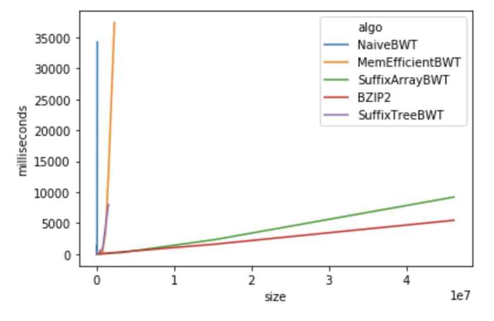
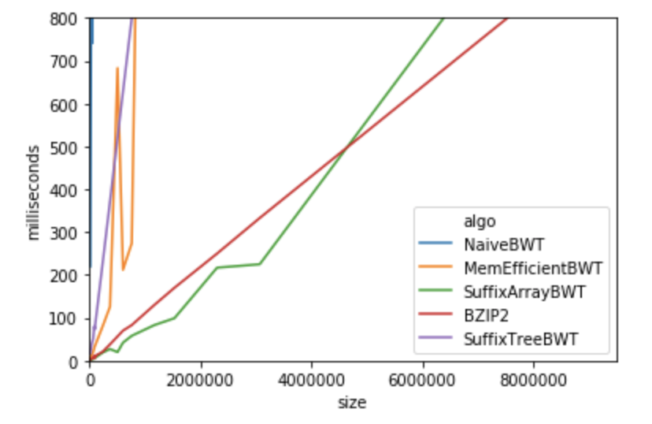

# Burrow-wheelers transoform in Golang.
*Graduation project for Algorithms course held at Projector in 2019.*

### About
This project aims to implement Burrow-Wheeler transform in Golang using various approaches and do some research on performance.

### Results
Burrow-Wheeler transform is based on sorting all existing string suffixes[1] in lexicographical order.
A range of approaches exists in implemented in this repo.

1. Naive approach - create all suffix in a loop and sort them. Take last symbol of rotational shift and obtain BWT result. N^2 logN if taking string comparison into consideration. O(N^2) memory 
2. Memory efficient naive approach[1]. We don't actually need to create every possible suffix, we can use pointers(indexes). Same complexity, but O(N) in memory.
3. SuffixTree - I've taken naive Suffix tree construction from RosettaCode, which is NlogN^2. Than, I've sorted suffix tree using build-in Go sorter, which is likely NlogN. Normally you can use Radix sort here in O(n). Faster algorytmhs exist for suffix tree construction also exist, but out of scope here.
4. SuffixArray - there's a build-in SuffixArray in GoLang, operating in linear time using [6][7].
5. I've benchmarked BZIP BWT subroutine and added as comparison.

#### Data
Benchmark results are in report/data.csv.

#### Benchmarks
Build-in Suffix Array is faster than BZIP implementation ... explain blocks and other nice findings here.

### TODO
 [x] Implement naive approach for compression
 [x] Benchmark naive approach and create tests and benchmarks
 [x] Benchmark approach from reference 2 - suffix array
 [x] Use suffixarray construction routine from golang std lib
 [x] Extract BWT part from BZIP2 and benchmark it.
 [x] Don't forget to show Naive BWT data
 

### References
1. Main explanation by authors - https://www.hpl.hp.com/techreports/Compaq-DEC/SRC-RR-124.pdf
2. Existing Golang implementation for comparisons - https://github.com/shenwei356/bwt/blob/master/bwt.go
3. Reference implementation in C as part of bzip2 - git://sourceware.org/git/bzip2.git
4. McCreight SufftixTree construction - https://dl.acm.org/citation.cfm?id=321946
5. Calgary compression corpus - http://www.data-compression.info/Corpora/CalgaryCorpus/
6. Linear time suffixarray building from 2003 - https://www.cs.helsinki.fi/u/tpkarkka/publications/icalp03.pdf
7. Another linear time suffixarray 2010 used in golang - https://ieeexplore.ieee.org/document/5582081 http://zork.net/~st/jottings/sais.html https://sites.google.com/site/yuta256/sais
